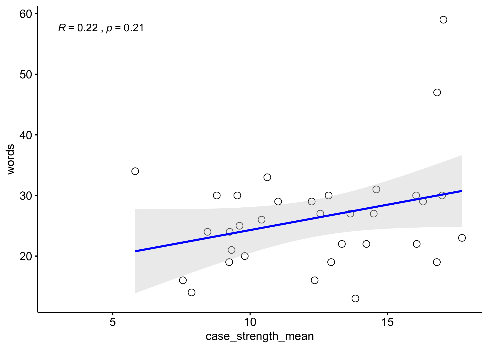

##Juror Crime Scenarios Sentiment Analysis {.tabset}

###Build, packages, & data
Session info

```r
devtools::session_info()
```

```
## ─ Session info ───────────────────────────────────────────────────────────────
##  setting  value                       
##  version  R version 3.5.1 (2018-07-02)
##  os       macOS  10.14.3              
##  system   x86_64, darwin15.6.0        
##  ui       X11                         
##  language (EN)                        
##  collate  en_US.UTF-8                 
##  ctype    en_US.UTF-8                 
##  tz       America/New_York            
##  date     2020-11-09                  
## 
## ─ Packages ───────────────────────────────────────────────────────────────────
##  package     * version date       lib source                      
##  assertthat    0.2.0   2017-04-11 [1] CRAN (R 3.5.0)              
##  backports     1.1.2   2017-12-13 [1] CRAN (R 3.5.0)              
##  callr         3.4.3   2020-03-28 [1] CRAN (R 3.5.1)              
##  cli           2.0.2   2020-02-28 [1] CRAN (R 3.5.2)              
##  crayon        1.3.4   2017-09-16 [1] CRAN (R 3.5.0)              
##  desc          1.2.0   2018-05-01 [1] CRAN (R 3.5.0)              
##  devtools      2.3.0   2020-04-10 [1] CRAN (R 3.5.1)              
##  digest        0.6.25  2020-02-23 [1] CRAN (R 3.5.2)              
##  ellipsis      0.3.0   2019-09-20 [1] CRAN (R 3.5.2)              
##  evaluate      0.14    2019-05-28 [1] CRAN (R 3.5.2)              
##  fansi         0.4.0   2018-10-05 [1] CRAN (R 3.5.0)              
##  fs            1.4.1   2020-04-04 [1] CRAN (R 3.5.1)              
##  glue          1.4.0   2020-04-03 [1] CRAN (R 3.5.1)              
##  htmltools     0.5.0   2020-06-16 [1] CRAN (R 3.5.1)              
##  knitr         1.30.2  2020-10-16 [1] Github (yihui/knitr@398ff08)
##  magrittr      1.5     2014-11-22 [1] CRAN (R 3.5.0)              
##  memoise       1.1.0   2017-04-21 [1] CRAN (R 3.5.0)              
##  pkgbuild      1.0.6   2019-10-09 [1] CRAN (R 3.5.2)              
##  pkgload       1.0.2   2018-10-29 [1] CRAN (R 3.5.0)              
##  prettyunits   1.0.2   2015-07-13 [1] CRAN (R 3.5.0)              
##  processx      3.4.2   2020-02-09 [1] CRAN (R 3.5.2)              
##  ps            1.3.2   2020-02-13 [1] CRAN (R 3.5.2)              
##  R6            2.4.1   2019-11-12 [1] CRAN (R 3.5.2)              
##  remotes       2.1.1   2020-02-15 [1] CRAN (R 3.5.2)              
##  rlang         0.4.5   2020-03-01 [1] CRAN (R 3.5.2)              
##  rmarkdown     2.4     2020-09-30 [1] CRAN (R 3.5.1)              
##  rprojroot     1.3-2   2018-01-03 [1] CRAN (R 3.5.0)              
##  sessioninfo   1.1.1   2018-11-05 [1] CRAN (R 3.5.0)              
##  stringi       1.4.3   2019-03-12 [1] CRAN (R 3.5.2)              
##  stringr       1.4.0   2019-02-10 [1] CRAN (R 3.5.2)              
##  testthat      2.3.2   2020-03-02 [1] CRAN (R 3.5.2)              
##  usethis       1.6.0   2020-04-09 [1] CRAN (R 3.5.1)              
##  withr         2.1.2   2018-03-15 [1] CRAN (R 3.5.0)              
##  xfun          0.18    2020-09-29 [1] CRAN (R 3.5.1)              
##  yaml          2.2.1   2020-02-01 [1] CRAN (R 3.5.2)              
## 
## [1] /Library/Frameworks/R.framework/Versions/3.5/Resources/library
```
Packages

```r
library(tidytext)
library(tidyr)
library(dplyr)
library(ggplot2)
library(ggcorrplot)
library(ggpubr)
library(wordcloud)
library(quanteda)
#robust correlation & regression
library(robcor)
library(MASS)
library(quantreg)
```
Data

```r
data <- read.csv(file="./scenario_classification.csv", header=TRUE, sep = ",", stringsAsFactors=FALSE)

data <- within(data, {
              crime_type <- factor(crime_type)
              category <- factor(category)
              jrl <- factor(jrl)
              class <- factor(class)
})
th <- theme_classic()
```
Set seed (for reproducible results) 

```r
set.seed(1000)
```

###Sentiment Analysis
Organize data

```r
crimes <- data %>%
  mutate(index = scenario) %>%
  ungroup()

tidy_crimes <- crimes %>%
  unnest_tokens(word, crime_description, token = "words")

#quick word count
word_count <- tidy_crimes %>%
  group_by(scenario) %>%
  summarise(count = n())
```

Run sentiment analysis - NRC

```r
sentiment_nrc <- tidy_crimes %>%
  anti_join(stop_words) %>%
  group_by(scenario) %>% 
  inner_join(get_sentiments("nrc"), by = "word") %>%
  count(index = index, sentiment) %>% 
  spread(sentiment, n, fill = 0) %>% 
  mutate(sentiment = positive - negative)
```

```
## Joining, by = "word"
```

```r
sentiment_nrc
```

```
## # A tibble: 33 x 13
## # Groups:   scenario [33]
##    scenario index anger anticipation disgust  fear   joy negative positive
##       <int> <int> <dbl>        <dbl>   <dbl> <dbl> <dbl>    <dbl>    <dbl>
##  1        1     1     2            0       1     2     0        2        0
##  2        2     2     2            1       0     2     1        2        2
##  3        3     3     2            0       1     2     0        2        1
##  4        4     4     2            3       0     1     2        1        3
##  5        5     5     1            2       1     1     2        5        3
##  6        6     6     2            1       1     1     1        2        2
##  7        7     7     3            1       1     3     1        3        1
##  8        8     8     2            1       0     1     0        3        1
##  9        9     9     1            1       0     0     1        0        1
## 10       10    10     2            0       1     2     0        2        1
## # … with 23 more rows, and 4 more variables: sadness <dbl>, surprise <dbl>,
## #   trust <dbl>, sentiment <dbl>
```

Run sentiment analysis - afinn (AFINN Lexicon: http://www2.imm.dtu.dk/pubdb/pubs/6010-full.html)

```r
sentiment_afinn <- tidy_crimes %>%
  anti_join(stop_words) %>%
  group_by(scenario) %>% 
  inner_join(get_sentiments("afinn"), by = "word") %>%
  summarise(sentiment_score = sum(score))
```

```
## Joining, by = "word"
```

```r
sentiment_afinn
```

```
## # A tibble: 32 x 2
##    scenario sentiment_score
##       <int>           <int>
##  1        1              -2
##  2        2              -2
##  3        3              -2
##  4        5              -2
##  5        6              -2
##  6        7              -5
##  7        8              -9
##  8        9              -1
##  9       10              -4
## 10       11              -8
## # … with 22 more rows
```

Run sentiment analysis - Bing:

```r
sentiment_bing <- tidy_crimes %>%
  anti_join(stop_words) %>%
  group_by(scenario) %>% 
  inner_join(get_sentiments("bing"), by = "word") %>%
  count(index = index, sentiment) %>%
  spread(sentiment, n, fill = 0) %>% 
  mutate(sentiment = positive - negative)
```

```
## Joining, by = "word"
```

```r
sentiment_bing
```

```
## # A tibble: 19 x 5
## # Groups:   scenario [19]
##    scenario index negative positive sentiment
##       <int> <int>    <dbl>    <dbl>     <dbl>
##  1        7     7        1        1         0
##  2        8     8        1        0        -1
##  3        9     9        0        1         1
##  4       10    10        3        0        -3
##  5       11    11        4        0        -4
##  6       12    12        1        0        -1
##  7       14    14        4        0        -4
##  8       15    15        1        1         0
##  9       16    16        2        0        -2
## 10       18    18        2        0        -2
## 11       19    19        1        0        -1
## 12       20    20        2        0        -2
## 13       21    21        3        0        -3
## 14       23    23        2        1        -1
## 15       24    24        1        0        -1
## 16       26    26        3        0        -3
## 17       27    27        1        0        -1
## 18       29    29        1        0        -1
## 19       33    33        1        0        -1
```

###Sentiment Distributions
Plot range of sentiment scores

```r
ggplot(sentiment_afinn, aes(x=sentiment_score)) + geom_histogram(binwidth = 1, color="black", fill="lightblue") + geom_vline(aes(xintercept=mean(sentiment_score)), color="blue", linetype="dashed", size=1)+th
```

<!-- -->

Plot w/density

```r
ggplot(sentiment_afinn, aes(x=sentiment_score)) + geom_histogram(aes(y=..density..), binwidth = 1, color="black", fill="lightblue") + geom_vline(aes(xintercept=mean(sentiment_score)), color="blue", linetype="dashed", size=1) + geom_density(alpha=.2, fill="#FF6666") + th
```

<!-- -->

###Sentiment Word counts

afinn

```r
afinn_word_counts <- tidy_crimes %>%
  inner_join(get_sentiments("afinn")) %>%
  mutate(sentiment = ifelse(test = (score > 0), 
                       yes = 'positive',
                       no = ifelse(test = (score < 0), 
                                   yes = 'negative',
                                   no = NA))) %>%
  count(word, sentiment, sort = TRUE) %>%
  ungroup()
```

```
## Joining, by = "word"
```

```r
afinn_word_counts
```

```
## # A tibble: 25 x 3
##    word      sentiment     n
##    <chr>     <chr>     <int>
##  1 accused   negative     31
##  2 killing   negative      3
##  3 murder    negative      3
##  4 died      negative      2
##  5 gun       negative      2
##  6 stopped   negative      2
##  7 united    positive      2
##  8 abandoned negative      1
##  9 alarm     negative      1
## 10 arrested  negative      1
## # … with 15 more rows
```

bing

```r
bing_word_counts <- tidy_crimes %>%
  inner_join(get_sentiments("bing")) %>%
  count(word, sentiment, sort = TRUE) %>%
  ungroup()
```

```
## Joining, by = "word"
```

```r
bing_word_counts
```

```
## # A tibble: 30 x 3
##    word        sentiment     n
##    <chr>       <chr>     <int>
##  1 killing     negative      3
##  2 murder      negative      3
##  3 stealing    negative      3
##  4 died        negative      2
##  5 knife       negative      2
##  6 alarm       negative      1
##  7 altercation negative      1
##  8 breaking    negative      1
##  9 burned      negative      1
## 10 condemned   negative      1
## # … with 20 more rows
```

nrc

```r
nrc_word_counts <- tidy_crimes %>%
  inner_join(get_sentiments("nrc")) %>%
  count(word, sentiment, sort = TRUE) %>%
  filter(sentiment == 'positive' | sentiment == 'negative') %>%
  ungroup()
```

```
## Joining, by = "word"
```

```r
nrc_word_counts
```

```
## # A tibble: 70 x 3
##    word         sentiment     n
##    <chr>        <chr>     <int>
##  1 accused      negative     31
##  2 shooting     negative      4
##  3 killing      negative      3
##  4 manslaughter negative      3
##  5 murder       negative      3
##  6 stealing     negative      3
##  7 store        positive      3
##  8 boy          negative      2
##  9 butler       positive      2
## 10 cash         positive      2
## # … with 60 more rows
```

Plot word counts - afinn

```r
afinn_word_counts %>%
  group_by(sentiment) %>%
  top_n(10) %>%
  ungroup() %>%
  mutate(word = reorder(word, n)) %>%
  ggplot(aes(word, n, fill = sentiment)) +
  geom_col(show.legend = FALSE, colour = 'black', fill='black') +
  facet_wrap(~sentiment, scales = "free_y") +
  labs(y = "Contribution to sentiment",
       x = NULL) +
  coord_flip() + th
```

```
## Selecting by n
```

<!-- -->

Plot word counts - Bing (Supp Fig. 3)

```r
bing_word_counts %>%
  group_by(sentiment) %>%
  top_n(10) %>%
  ungroup() %>%
  mutate(word = reorder(word, n)) %>%
  ggplot(aes(word, n, fill = sentiment)) +
  geom_col(show.legend = FALSE, colour = 'black', fill='black') +
  facet_wrap(~sentiment, scales = "free_y") +
  labs(y = "Contribution to sentiment",
       x = NULL) +
  coord_flip() + th
```

```
## Selecting by n
```

<!-- -->

Plot word counts - NRC

```r
nrc_word_counts %>%
  group_by(sentiment) %>%
  top_n(10) %>%
  ungroup() %>%
  mutate(word = reorder(word, n)) %>%
  ggplot(aes(word, n, fill = sentiment)) +
  geom_col(show.legend = FALSE, colour = 'black', fill='black') +
  facet_wrap(~sentiment, scales = "free_y") +
  labs(y = "Contribution to sentiment",
       x = NULL) +
  coord_flip() + th
```

```
## Selecting by n
```

<!-- -->

###Reading Grade Level

```r
# word, sentence, and syllable counts, plus reading scores
read_lvl <- data %>%
  mutate(syllables = nsyllable(crime_description),
         sentences = nsentence(crime_description),
         words = ntoken(crime_description, remove_punct = TRUE),
         fk_grade = 0.39*(words/sentences) + 11.8*(syllables/words) - 15.59) %>%
  arrange(scenario)

read_lvl <- dplyr::select(read_lvl,-c(2,3,4,5,6,7,8))
```

###Save the data

```r
#sentiment & word count
all_data <- data %>%
  #inner_join(sentiment, by = "scenario") %>%
  inner_join(word_count, by = "scenario") %>%
  inner_join(sentiment_nrc, by = "scenario") %>%
  inner_join(read_lvl, by = "scenario")
  
write.csv(all_data,
          file = "./scenario_classification_with_sentiment_scores.csv",
          row.names = FALSE)


afinn_data<-data %>%
  inner_join(sentiment_afinn, by = 'scenario')

bing_data<-data %>%
  inner_join(sentiment_bing, by = 'scenario')
```

###Correlation Matrix
Sentiment from NRC

```r
corr <- round(cor(all_data[7:25],method="spearman"), 3)

ggcorrplot(corr, hc.order = FALSE, type = "lower", outline.color = "white",
   lab = TRUE)
```

<!-- -->

Sentiment from AFINN (N=32 scenarios)

```r
corr <- round(cor(afinn_data[7:9],method="spearman"), 3)

ggcorrplot(corr, hc.order = FALSE, type = "lower", outline.color = "white",
   lab = TRUE)
```

<!-- -->

Sentiment from Bing (N=19 scenarios)

```r
corr <- round(cor(bing_data[7:12],method="spearman"), 3)

ggcorrplot(corr, hc.order = FALSE, type = "lower", outline.color = "white",
   lab = TRUE)
```

<!-- -->

###Sentiment Score Correlation Plots

NRC Sentiment

```r
#sentiment - case strength
ggscatter(all_data, x = "case_strength_mean", y = "sentiment",
   color = "black", shape = 21, size = 3,
   add = "reg.line",
   add.params = list(color = "blue", fill = "lightgray"),
   conf.int = TRUE,
   cor.coef = TRUE,
   cor.coeff.args = list(method = "spearman", label.x = 3, label.sep = "\n")
   ) + th
```

```
## `geom_smooth()` using formula 'y ~ x'
```

<!-- -->

```r
#sentiment - punishment
ggscatter(all_data, x = "punishment_mean", y = "sentiment",
   color = "black", shape = 21, size = 3, # Points color, shape and size
   add = "reg.line",  # Add regressin line
   add.params = list(color = "blue", fill = "lightgray"), # Customize reg. line
   conf.int = TRUE, # Add confidence interval
   cor.coef = TRUE, # Add correlation coefficient. see ?stat_cor
   cor.coeff.args = list(method = "pearson", label.x = 3, label.sep = "\n")
   ) + th
```

```
## `geom_smooth()` using formula 'y ~ x'
```

<!-- -->

AFINN Sentiment

```r
#sentiment - case strength
ggscatter(afinn_data, x = "case_strength_mean", y = "sentiment_score",
   color = "black", shape = 21, size = 3,
   add = "reg.line",
   add.params = list(color = "blue", fill = "lightgray"),
   conf.int = TRUE,
   cor.coef = TRUE,
   cor.coeff.args = list(method = "spearman", label.x = 3, label.sep = "\n")
   ) + th
```

```
## `geom_smooth()` using formula 'y ~ x'
```

<!-- -->

```r
#sentiment - punishment
ggscatter(afinn_data, x = "punishment_mean", y = "sentiment_score",
   color = "black", shape = 21, size = 3, # Points color, shape and size
   add = "reg.line",  # Add regressin line
   add.params = list(color = "blue", fill = "lightgray"), # Customize reg. line
   conf.int = TRUE, # Add confidence interval
   cor.coef = TRUE, # Add correlation coefficient. see ?stat_cor
   cor.coeff.args = list(method = "pearson", label.x = 3, label.sep = "\n")
   ) + th
```

```
## `geom_smooth()` using formula 'y ~ x'
```

<!-- -->

Bing Sentiment

```r
#sentiment - case strength
ggscatter(bing_data, x = "case_strength_mean", y = "sentiment",
   color = "black", shape = 21, size = 3,
   add = "reg.line",
   add.params = list(color = "blue", fill = "lightgray"),
   conf.int = TRUE,
   cor.coef = TRUE,
   cor.coeff.args = list(method = "spearman", label.x = 3, label.sep = "\n")
   ) + th
```

```
## `geom_smooth()` using formula 'y ~ x'
```

<!-- -->

```r
#sentiment - punishment
ggscatter(bing_data, x = "punishment_mean", y = "sentiment",
   color = "black", shape = 21, size = 3, # Points color, shape and size
   add = "reg.line",  # Add regressin line
   add.params = list(color = "blue", fill = "lightgray"), # Customize reg. line
   conf.int = TRUE, # Add confidence interval
   cor.coef = TRUE, # Add correlation coefficient. see ?stat_cor
   cor.coeff.args = list(method = "pearson", label.x = 3, label.sep = "\n")
   ) + th
```

```
## `geom_smooth()` using formula 'y ~ x'
```

<!-- -->

###Word Count Correlation Plots

```r
#word count - case strength
ggscatter(all_data, x = "case_strength_mean", y = "words",
   color = "black", shape = 21, size = 3,
   add = "reg.line",
   add.params = list(color = "blue", fill = "lightgray"),
   conf.int = TRUE,
   cor.coef = TRUE,
   cor.coeff.args = list(method = "spearman", label.x = 3, label.sep = "\n")
   )
```

```
## `geom_smooth()` using formula 'y ~ x'
```

<!-- -->

```r
#word count - punishment
ggscatter(all_data, x = "punishment_mean", y = "words",
   color = "black", shape = 21, size = 3, # Points color, shape and size
   add = "reg.line",  # Add regressin line
   add.params = list(color = "blue", fill = "lightgray"), # Customize reg. line
   conf.int = TRUE, # Add confidence interval
   cor.coef = TRUE, # Add correlation coefficient. see ?stat_cor
   cor.coeff.args = list(method = "pearson", label.x = 3, label.sep = "\n")
   )
```

```
## `geom_smooth()` using formula 'y ~ x'
```

<!-- -->

###Robust Correlations & Regression

```r
#correlation matrix
rob_corr <- round(robcor(all_data[7:25],method="quadrant"), 3)
```

```
## Loading required package: sfsmisc
```

```
## 
## Attaching package: 'sfsmisc'
```

```
## The following object is masked from 'package:dplyr':
## 
##     last
```

```r
ggcorrplot(rob_corr, hc.order = FALSE, type = "lower", outline.color = "white",
   lab = TRUE)
```

<!-- -->


```r
#robust regression
#https://rpubs.com/dvallslanaquera/robust_regression

pun_wc_mod <- rlm(words ~ punishment_mean, all_data, psi = psi.bisquare)
summary(pun_wc_mod)
```

```
## 
## Call: rlm(formula = words ~ punishment_mean, data = all_data, psi = psi.bisquare)
## Residuals:
##      Min       1Q   Median       3Q      Max 
## -12.8738  -4.1957   0.9676   4.2572  31.6815 
## 
## Coefficients:
##                 Value   Std. Error t value
## (Intercept)     21.3693  3.1008     6.8914
## punishment_mean  0.0716  0.0573     1.2481
## 
## Residual standard error: 6.313 on 31 degrees of freedom
```

```r
#Linear
fitLS <- lm(words ~ punishment_mean, data = all_data)
summary(fitLS)
```

```
## 
## Call:
## lm(formula = words ~ punishment_mean, data = all_data)
## 
## Residuals:
##     Min      1Q  Median      3Q     Max 
## -15.383  -5.313  -1.374   2.721  27.261 
## 
## Coefficients:
##                 Estimate Std. Error t value Pr(>|t|)    
## (Intercept)     17.91870    3.96510   4.519 8.48e-05 ***
## punishment_mean  0.16622    0.07331   2.268   0.0305 *  
## ---
## Signif. codes:  0 '***' 0.001 '**' 0.01 '*' 0.05 '.' 0.1 ' ' 1
## 
## Residual standard error: 8.42 on 31 degrees of freedom
## Multiple R-squared:  0.1423,	Adjusted R-squared:  0.1146 
## F-statistic: 5.142 on 1 and 31 DF,  p-value: 0.03048
```

```r
#Huber Estimator
fitH <- rlm(words ~ punishment_mean, data = all_data, k2 = 1.345)
summary(fitH)
```

```
## 
## Call: rlm(formula = words ~ punishment_mean, data = all_data, k2 = 1.345)
## Residuals:
##      Min       1Q   Median       3Q      Max 
## -13.7041  -4.1998   0.4257   2.9800  30.1081 
## 
## Coefficients:
##                 Value   Std. Error t value
## (Intercept)     19.8826  3.3039     6.0180
## punishment_mean  0.1084  0.0611     1.7740
## 
## Residual standard error: 6.227 on 31 degrees of freedom
```

```r
#Least Mean Square
fitLMS <- lqs(words ~ punishment_mean, data = all_data, method = "lms")
summary(fitLMS)
```

```
##               Length Class      Mode     
## crit           1     -none-     numeric  
## sing           1     -none-     character
## coefficients   2     -none-     numeric  
## bestone        2     -none-     numeric  
## fitted.values 33     -none-     numeric  
## residuals     33     -none-     numeric  
## scale          2     -none-     numeric  
## terms          3     terms      call     
## call           4     -none-     call     
## xlevels        0     -none-     list     
## model          2     data.frame list
```

```r
#Least Trimmed Square
fitLTS <- lqs(words ~ punishment_mean, data = all_data, method = "lts")
summary(fitLTS)
```

```
##               Length Class      Mode     
## crit           1     -none-     numeric  
## sing           1     -none-     character
## coefficients   2     -none-     numeric  
## bestone        2     -none-     numeric  
## fitted.values 33     -none-     numeric  
## residuals     33     -none-     numeric  
## scale          2     -none-     numeric  
## terms          3     terms      call     
## call           4     -none-     call     
## xlevels        0     -none-     list     
## model          2     data.frame list
```

```r
#S-estimator (The "S" estimation method solves for the scale s such that the average of a function chi of the residuals divided by s is equal to a given constant.)
fitS <- lqs(words ~ punishment_mean, data = all_data, method = "S")
summary(fitS)
```

```
##               Length Class      Mode     
## crit           1     -none-     numeric  
## sing           1     -none-     character
## coefficients   2     -none-     numeric  
## bestone        2     -none-     numeric  
## fitted.values 33     -none-     numeric  
## residuals     33     -none-     numeric  
## scale          1     -none-     numeric  
## coefficents    2     -none-     numeric  
## terms          3     terms      call     
## call           4     -none-     call     
## xlevels        0     -none-     list     
## model          2     data.frame list
```

```r
#MM-estimator(Selecting method = "MM" selects a specific set of options which ensures that the estimator has a high breakdown point. The initial set of coefficients and the final scale are selected by an S-estimator with k0 = 1.548; this gives (for n≫p) breakdown point 0.5. The final estimator is an M-estimator with Tukey's biweight and fixed scale that will inherit this breakdown point provided c > k0; this is true for the default value of c that corresponds to 95% relative efficiency at the normal.)
fitMM <- rlm(words ~ punishment_mean, data = all_data, method = "MM")
summary(fitMM)
```

```
## 
## Call: rlm(formula = words ~ punishment_mean, data = all_data, method = "MM")
## Residuals:
##      Min       1Q   Median       3Q      Max 
## -12.8995  -4.2247   0.9713   4.2226  31.6409 
## 
## Coefficients:
##                 Value   Std. Error t value
## (Intercept)     21.3484  3.0968     6.8936
## punishment_mean  0.0723  0.0573     1.2627
## 
## Residual standard error: 6.478 on 31 degrees of freedom
```

```r
#plot
plot(y=all_data$words, x=all_data$punishment_mean,
      xlab = "punishment", ylab = "word count", type = "p", 
      pch = 20, cex = 1.5)
abline(fitLS, col = 1) 
abline(fitH, col = 2) 
abline(fitLTS, col = 3) 
abline(fitLMS, col = 4) 
abline(fitS, col = 5) 
abline(fitMM, col = 6) 
legend(20, 60, c("LS", "Huber","LTS","LMS",
                  "S-estimator","MM-estimator" ),
           lty = rep(1, 6), bty = "n",
           col = c(1, 2, 3, 4, 5, 6))
```

<!-- -->

quantile & robust regression

```r
#quantile
#http://www.alastairsanderson.com/R/tutorials/robust-regression-in-R/
fitQuantileReg <- rq(words ~ punishment_mean, data=all_data)
summary(fitQuantileReg)
```

```
## 
## Call: rq(formula = words ~ punishment_mean, data = all_data)
## 
## tau: [1] 0.5
## 
## Coefficients:
##                 coefficients lower bd upper bd
## (Intercept)     17.72554     11.62070 26.00657
## punishment_mean  0.14745      0.03404  0.23776
```

```r
#robust
fitRLM <- rlm(words ~ punishment_mean, data=all_data)
summary(fitRLM)
```

```
## 
## Call: rlm(formula = words ~ punishment_mean, data = all_data)
## Residuals:
##      Min       1Q   Median       3Q      Max 
## -13.7041  -4.1998   0.4257   2.9800  30.1081 
## 
## Coefficients:
##                 Value   Std. Error t value
## (Intercept)     19.8826  3.3039     6.0180
## punishment_mean  0.1084  0.0611     1.7740
## 
## Residual standard error: 6.227 on 31 degrees of freedom
```

```r
ggplot(data=all_data, aes(x=punishment_mean, y=words)) +
  geom_point() +                                                   
  geom_smooth(method="lm", aes(colour="lm"), se=FALSE) +
  geom_smooth(method="rq", aes(colour="rq"), se=FALSE) +
  geom_smooth(method="rlm", aes(colour="rlm"), se=FALSE) +
  labs(colour=NULL) + theme_classic()
```

```
## `geom_smooth()` using formula 'y ~ x'
## `geom_smooth()` using formula 'y ~ x'
## `geom_smooth()` using formula 'y ~ x'
```

<!-- -->

